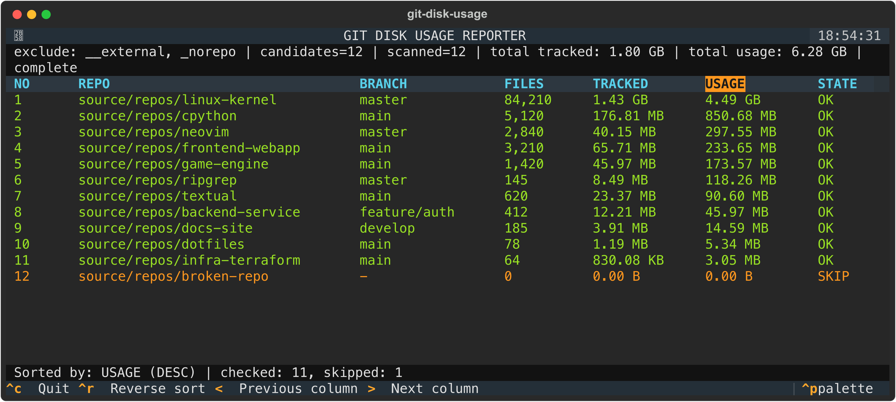

# git-disk-usage

A real-time TUI to monitor Git repo disk usage: pack history and tracked files.



## Installation

### Global CLI (Recommended)

Install globally so `git-disk-usage` or `git du` can be run from any directory:

```bash
./install.sh
# Or via Make:
make install-global
```

> Symlinks are added to `~/.local/bin`. Ensure this directory is in your `PATH`.

### Local Virtual Environment

```bash
python -m venv .venv
source .venv/bin/activate  # Windows: .\.venv\Scripts\activate
pip install -r requirements.txt
pip install -e .
```

## Usage

Run from any directory containing Git repositories:

```bash
git-disk-usage
```

Or use the short alias:

```bash
git-du
# Or via Git subcommand:
git du
```

Direct module execution:

```bash
python -m git_disk_usage
```

## Keybindings

| Key            | Action                  |
| -------------- | ----------------------- |
| `<` / `,`      | Sort by previous column |
| `>` / `.`      | Sort by next column     |
| `Ctrl+R`       | Reverse sort direction  |
| `q` / `Ctrl+C` | Quit                    |

## Notes

- Repositories are detected by the presence of a `.git` directory.
  - Subdirectories within a detected repository are not scanned for nested repositories.
- Excluded directory names by default: `__external`, `_norepo`.
